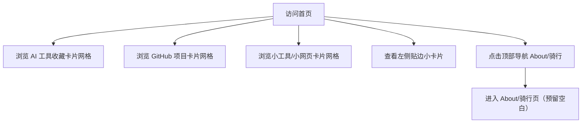

# 产品需求文档：个人网页（AI 工具收藏与作品展示） - V1.0

## 1. 综述 (Overview)
### 1.1 项目背景与核心问题
用户需要一个个人网页，主要用于“AI 工具收藏 + GitHub 项目整理 + 小工具/小网页展示”，同时作为对潜在合作方的展示入口。页面保持简洁，无标题/标语，首页直接展示所有内容；关于/骑行页仅作为预留页面，后续再补充内容。

### 1.2 核心业务流程 / 用户旅程地图
1. **阶段一：进入首页** - 访问首页，看到顶部导航与内容模块
2. **阶段二：浏览收藏与作品** - 以卡片网格方式浏览三大模块内容
3. **阶段三：进入关于页** - 通过导航进入 About/骑行页（暂为空白占位）

### 1.3 Mermaid 图（流程/状态/时序）
> 说明：Mermaid 图用于“需求对齐”，避免歧义；避免写成技术实现细节（不要写 API 路径、字段、HTTP code、框架/库）。

#### 1.3.1 用户操作流（必填）


## 2. 用户故事详述 (User Stories)

### 阶段一：进入首页

---

#### **US-01: 作为访客/潜在合作方/本人，我希望打开首页即可看到完整内容结构，以便于快速浏览收藏与作品**
* **价值陈述 (Value Statement)**:
  * **作为** 访客/潜在合作方/本人
  * **我希望** 首页直接展示三大模块，并有清晰导航
  * **以便于** 快速了解我使用的工具与我做的作品

* **业务规则与逻辑 (Business Logic)**:
  1. **前置条件**: 用户访问首页
  2. **操作流程 (Happy Path)**:
     - 顶部右上角显示导航：Home | About/骑行
     - 页面无标题/标语
     - 左侧贴边小卡片有边框，内容为：头像 + 名字 + 一句话 + 联系方式
     - 三个模块按优先级显示：AI 工具收藏 → GitHub 开源项目整理 → 小工具/小网页展示
     - 每个模块标题后带一行简短描述（文案可后续自定义）
     - 模块内容以卡片网格展示（非整行横幅）
  3. **异常处理 (Error Handling)**:
     - 当某模块无内容时，显示“后续补充”

* **验收标准 (Acceptance Criteria)**:
  * **场景1: 首页结构**
    * **GIVEN** 用户进入首页
    * **WHEN** 页面加载完成
    * **THEN** 右上角仅显示 Home | About/骑行 导航，页面无标题/标语
  * **场景2: 侧边卡片**
    * **GIVEN** 首页展示完成
    * **WHEN** 用户查看左侧区域
    * **THEN** 看到有边框的小卡片，包含头像、名字、一句话、联系方式
  * **场景3: 模块顺序与描述**
    * **GIVEN** 首页内容显示
    * **WHEN** 用户从上往下浏览
    * **THEN** 依次看到 AI 工具收藏、GitHub 项目整理、小工具/小网页展示，每个模块带简短描述
  * **场景4: 无内容模块**
    * **GIVEN** 某模块暂无卡片数据
    * **WHEN** 用户查看该模块
    * **THEN** 显示“后续补充”

* **页面布局线框图 (ASCII Wireframe)**:
    ```text
    ┌──────────────────────────────────────────────────────────────────────────┐
    │                                            导航：Home | About/骑行         │
    ├──────────────────────────────────────────────────────────────────────────┤
    │ ┌───────────────┐  AI 工具收藏 — 我常用的工具集合                          │
    │ │ 头像          │  ┌──────────┬──────────┬──────────┐                      │
    │ │ 名字          │  │ 图标 名称│ 图标 名称│ 图标 名称│                      │
    │ │ 一句话        │  │ 简介+链接│ 简介+链接│ 简介+链接│                      │
    │ │ 联系方式      │  └──────────┴──────────┴──────────┘                      │
    │ └───────────────┘  GitHub 开源项目整理 — 我使用的项目                      │
    │                   ┌──────────┬──────────┬──────────┐                      │
    │                   │ 图标 名称│ 图标 名称│ 图标 名称│                      │
    │                   │ 简介+链接│ 简介+链接│ 简介+链接│                      │
    │                   └──────────┴──────────┴──────────┘                      │
    │                   小工具/小网页展示 — 我自己做的小作品                      │
    │                   ┌──────────┬──────────┬──────────┐                      │
    │                   │ 图标 名称│ 图标 名称│ 图标 名称│                      │
    │                   │ 简介+链接│ 简介+链接│ 简介+链接│                      │
    │                   └──────────┴──────────┴──────────┘                      │
    └──────────────────────────────────────────────────────────────────────────┘
    ```

---

#### **US-02: 作为浏览者，我希望三类卡片结构一致，以便于快速理解内容**
* **价值陈述 (Value Statement)**:
  * **作为** 浏览者
  * **我希望** 所有卡片信息结构统一
  * **以便于** 更快比较与选择

* **业务规则与逻辑 (Business Logic)**:
  1. **前置条件**: 模块中存在卡片数据
  2. **操作流程 (Happy Path)**:
     - 三类卡片字段统一：图标 + 名称 + 一句话简介 + 外部链接
     - 外部链接仅“链接文本”可点击，卡片本体不可点击
     - 图标优先使用官方 Logo
     - 一句话简介长度 ≤ 30 字
  3. **异常处理 (Error Handling)**:
     - 当模块无卡片数据时，显示“后续补充”

* **验收标准 (Acceptance Criteria)**:
  * **场景1: 统一结构**
    * **GIVEN** 任意模块存在卡片
    * **WHEN** 用户查看卡片
    * **THEN** 卡片包含图标、名称、一句话简介、外部链接文本
  * **场景2: 链接可点击范围**
    * **GIVEN** 用户在卡片上操作
    * **WHEN** 点击非链接文本区域
    * **THEN** 不触发跳转
  * **场景3: 简介长度**
    * **GIVEN** 任何卡片显示简介
    * **WHEN** 文案渲染完成
    * **THEN** 简介不超过 30 字
  * **场景4: 空状态**
    * **GIVEN** 某模块无卡片
    * **WHEN** 用户查看该模块
    * **THEN** 看到“后续补充”

* **页面布局线框图 (ASCII Wireframe)**:
    ```text
    ┌─────────────────────┐
    │ [图标]  名称         │
    │ 一句话简介（≤30字）  │
    │ 官网/链接文本        │
    └─────────────────────┘

    ┌─────────────────────────────────────────────────────────┐
    │ 后续补充                                                  │
    └─────────────────────────────────────────────────────────┘
    ```

---

#### **US-03: 作为浏览者，我希望能进入 About/骑行页，以便于后续查看更多内容**
* **价值陈述 (Value Statement)**:
  * **作为** 浏览者
  * **我希望** About/骑行页可访问
  * **以便于** 未来补充内容时有固定入口

* **业务规则与逻辑 (Business Logic)**:
  1. **前置条件**: 用户在首页
  2. **操作流程 (Happy Path)**:
     - 点击顶部右上角导航中的 About/骑行
     - 进入 About/骑行页
     - 页面仅保留顶部导航，其余内容空白预留
  3. **异常处理 (Error Handling)**:
     - 无

* **验收标准 (Acceptance Criteria)**:
  * **场景1: 可访问性**
    * **GIVEN** 用户在首页
    * **WHEN** 点击 About/骑行
    * **THEN** 成功进入 About/骑行页
  * **场景2: 导航一致性**
    * **GIVEN** 用户进入 About/骑行页
    * **WHEN** 页面渲染完成
    * **THEN** 顶部右上角显示 Home | About/骑行
  * **场景3: 空白预留**
    * **GIVEN** 用户进入 About/骑行页
    * **WHEN** 查看页面内容区域
    * **THEN** 为空白预留区域

* **页面布局线框图 (ASCII Wireframe)**:
    ```text
    ┌──────────────────────────────────────────────────────────────────────────┐
    │                                            导航：Home | About/骑行         │
    ├──────────────────────────────────────────────────────────────────────────┤
    │                                                                          │
    │                     （此处为预留内容区域，暂不展示）                      │
    │                                                                          │
    └──────────────────────────────────────────────────────────────────────────┘
    ```
